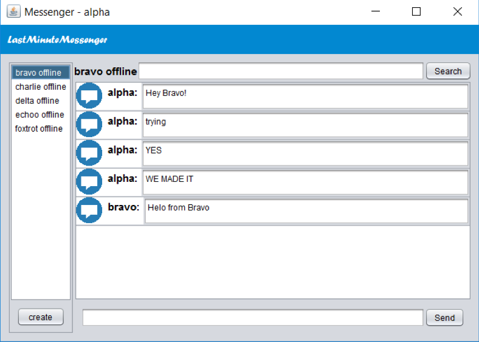
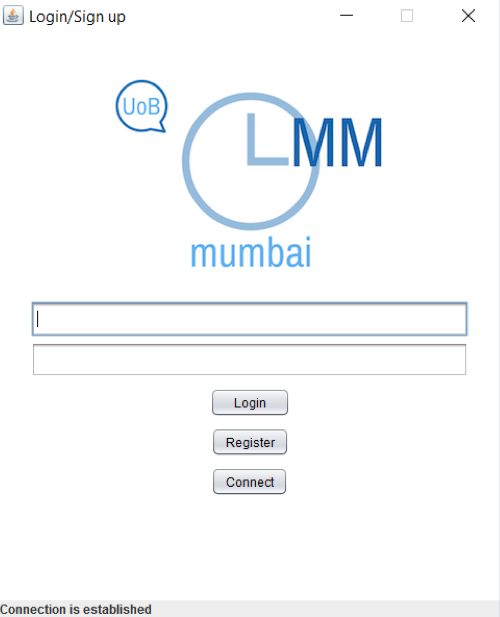
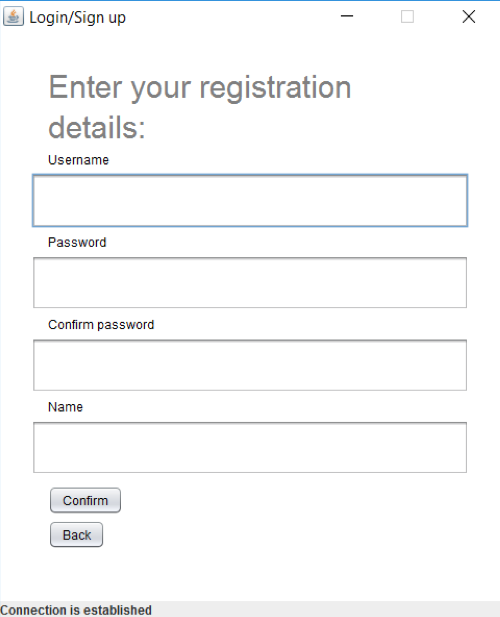

# LMM 
### Last Minute Messenger - Group Chattin'

This is a group project of team Mumbai, part of the curriculum in the Computer Science MSc in the University of Birmingham.
Team Mumbai members: Nabeel Anwar, Ioana Avirvarei, Maurice Noel Bouniol, Roman Gaev, Ali Oztas.

This projects idea was to build a multi-threaded, instant messaging service where each user can create chat rooms for group or one-to-one chatting, with technologies that we have learnt during the course. Thus, Java is mainly used with PostgreSQL.

The application is based on a three-tier-architecture, with Java being used for the whole app.
For the front end Java Swing is used, with Java in the back end and PostgreSQL in the Data layer. JDBC driver for the PostgreSQL, custom protocol for communication.

Every client connects to the server, which listens for new messages over TCP/IP. Several workers in the server take care of the processes running, each new message gets stored in the database for archiving, thus a user can "scroll up" to find older messages even when recconecting to the service through another machine.

### Chatroom 

### Login 

### Register

